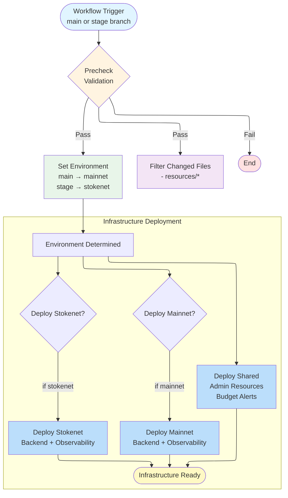

## Pipeline Overview

### Triggers
- **Push to `main`**: Deploys to mainnet environment
- **Push to `stage`**: Deploys to stokenet environment
- **Manual dispatch**: Choose environment

### Key Features

#### Concurrency Controls
- Top-level: `deploy-${{ github.ref }}` - Queues deployments from same branch
- Per-environment: `mainnet-deployment`, `stokenet-deployment`, `shared-deployment`
- Prevents Terraform state conflicts

#### Path Filters
Resources only deploy when their configuration changes:
- `resources/shared/**`
- `resources/mainnet/**`
- `resources/stokenet/**`

### Deployment Sequence

1. **Validation** (on PR): Terraform fmt + validate
2. **Environment Selection**: Determine mainnet or stokenet
3. **Infrastructure**:
   - Deploy shared (always)
   - Deploy mainnet (if main branch)
   - Deploy stokenet (if stage branch)

