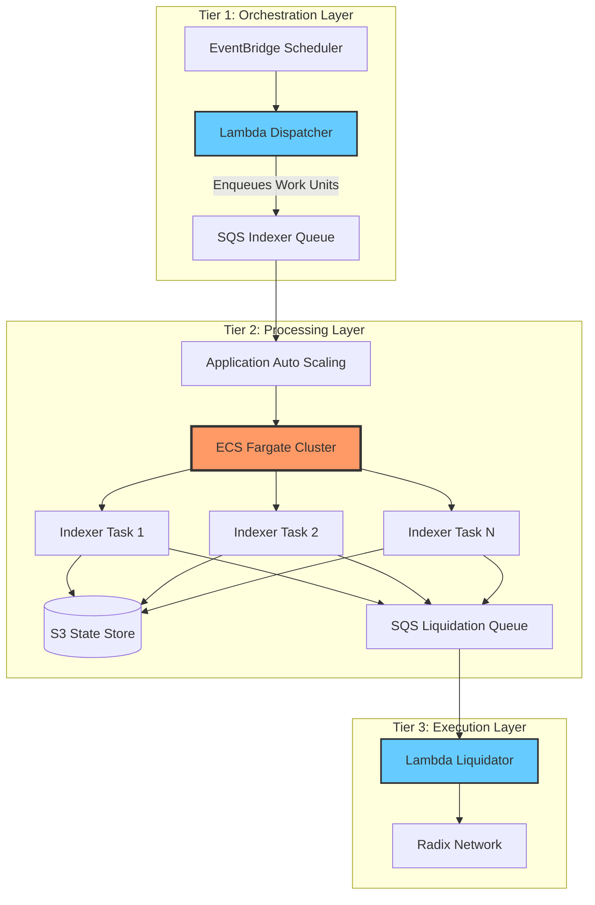

# Enterprise-Grade Cloud Infrastructure for DeFi

This repository implements the cloud-native backend infrastructure for **Weft Finance**, a decentralized lending protocol built on Radix DLT. The system maintains real-time synchronization with blockchain state while executing time-critical liquidations that can scale to handle thousands of concurrent operations.

---
## System Overview

The system monitors thousands of Collateralized Debt Positions (CDPs) on the Radix ledger. When market conditions shift and positions become under-collateralized, they must be liquidated immediately to protect protocol solvency. This creates three competing requirements: maintaining accurate blockchain state, processing liquidations within seconds of detection, and optimizing cloud costs across highly variable workloads.

The solution is a decoupled, event-driven architecture that separates workload scheduling, state processing, and transaction execution into specialized tiers. Each tier uses the most appropriate AWS service for its specific characteristics, resulting in a system that scales from near-zero cost during idle periods to handling thousands of concurrent operations during market volatility.

## Design Philosophy

### Asynchronous Event-Driven Architecture

Every tier communicates exclusively via Amazon SQS, creating strong decoupling between components. The Dispatcher can continue queueing work even if the Indexer is down for maintenance. When the Indexer restarts, it simply processes the backlog at its own pace. This decoupling also provides natural back-pressure management. We don't overwhelm the Radix Gateway with thousands of simultaneous requests; instead, we process at a rate our downstream dependencies can handle, controlled by the number of running ECS tasks.

SQS provides at-least-once delivery guarantees, meaning work is never lost. If an Indexer task crashes mid-processing, the message becomes visible again after the visibility timeout expires, and another task picks it up. Queue depth metrics expose system health clearly. If the Liquidation queue grows faster than Lambda can drain it, we immediately know there's a bottleneck to investigate.

The tradeoff is eventual consistency. There's typically a 30-90 second delay between a blockchain state change and liquidation execution. For Weft Finance, this latency is acceptable given the protocol's design and typical market movement speeds. For high-frequency trading applications, this architecture would not be appropriate.

### Infrastructure as Code: Modular Design

The Terraform codebase follows a three-layer hierarchy. At the bottom are generic modules that implement AWS primitives like S3 buckets, VPC configurations, and ECS clusters. These modules are reusable across any project. The middle layer consists of blueprints that compose modules into complete service architectures, such as the liquidation service combining queues, compute, and storage into a cohesive system. The top layer contains environments, where we instantiate blueprints with specific parameters for mainnet versus stokenet.

This structure enables environment parity. Both mainnet and stokenet use identical infrastructure code, differing only in parameters like CPU allocation and memory limits. This eliminates "works in staging but fails in production" issues that plague organizations using different infrastructure patterns across environments. Adding a third environment like devnet requires only a 20-line configuration file that references the existing blueprint.

The upfront complexity is higher than a flat Terraform structure. Writing the initial modules and blueprints takes more time than writing inline resources. However, this investment pays dividends as the system evolves. Changes propagate consistently across all environments, testing becomes systematic rather than ad-hoc, and new team members can understand the architecture by reading the blueprint structure rather than parsing thousands of lines of resource definitions.

---

## The 3-Tier Architecture + Supporting Services

### Tier 1: Orchestration Layer (The Dispatcher)

The Dispatcher is an AWS Lambda function triggered by EventBridge on a configurable schedule (typically every 1-5 minutes). It queries the Radix Gateway API for the current ledger epoch, partitions the workload into batches of CDPs, and enqueues messages to the Indexer SQS queue.

Lambda is used here for its cost-efficiency at low duty cycles. The dispatcher runs briefly and is stateless, making it a perfect fit for serverless execution.

### Tier 2: Processing Layer (The Indexer)

The Indexer performs the heavy computational work. It runs as a cluster of ECS Fargate tasks that scale based on the SQS queue depth. Each task consumes messages, fetches full CDP data via the Radix Gateway API, calculates health ratios, and persists the results to an S3 bucket (or checks against a threshold).

Key characteristics:
- **Auto-scaling**: The number of tasks scales out when the queue grows (e.g., >30 messages per task) and scales in to zero when the queue is empty.
- **Persistent Compute**: Fargate is chosen over Lambda here to avoid timeout limits during heavy indexing sessions and to potentially benefit from connection pooling, though the primary driver is the long-running nature of processing large batches of CDPs.
- **State Storage**: S3 is used as a highly durable and cost-effective key-value store for CDP state data.

### Tier 3: Execution Layer (The Liquidator)

The Liquidator is an AWS Lambda function triggered directly by the Liquidation SQS queue. When the Indexer identifies an under-collateralized position, it sends a message to this queue.

- **Event-Driven**: The Lambda executes immediately upon receiving a message.
- **Concurrency**: AWS Lambda scales concurrently to handle bursts of liquidations (up to the configured concurrency limit, e.g., 50), ensuring protocols remain solvent even during market crashes.
- **Isolation**: Each liquidation is an independent execution, preventing failures from cascading.

---

## Observability

The system prioritizes comprehensive visibility through a **Grafana Cloud** integration, managed via the `grafana-metrics` and `grafana-logs` blueprints.

- **Logs (Loki)**: Logs from Lambda functions and ECS tasks are shipped to Grafana Loki via Promtail (running as a Lambda extension or sidecar). This allows for powerful querying and aggregation of logs across all services.
- **Metrics (Prometheus)**: CloudWatch metrics are scraped and forwarded to Grafana Prometheus, enabling real-time dashboards for queue depths, task counts, and error rates.
- **Cost Tracking**: While CloudWatch provides the raw data, Grafana dashboards help visualize cost attribution per service.

## Governance & Security

### Admin & Security Layer
The `admin` blueprint establishes the security and governance baseline:
- **GitHub OIDC**: Enables secure, keyless authentication for GitHub Actions to deploy infrastructure, eliminating the need for long-lived AWS access keys.
- **AWS Budgets**: Configures budget alerts (e.g., at 85% and 100% of the monthly limit) to prevent cost overruns, sending notifications to the engineering team.
- **Artifacts Bucket**: A secure S3 bucket is used to store administrative artifacts (like the Promtail binary for logging) with strict access controls.

---

## Infrastructure as Code

The 3-layer structure (Modules → Blueprints → Environments) described above is implemented as follows:

| Layer | Path | Purpose |
|-------|------|----------|
| **Modules** | `modules/` | Generic AWS primitives (`secure_s3_bucket`, `ecs_autoscaling_service`, `scheduled_lambda`) |
| **Blueprints** | `blueprints/` | Composed services (e.g., `liquidation-service` = ECS + Lambda + SQS) |
| **Environments** | `environments/` | Deployment configs (`mainnet`, `stokenet`) with environment-specific parameters |

### Repository Structure

Since we use blueprints, creating a new environment (like a `devnet`) is as simple as creating a new directory in `environments/` and calling the existing blueprints with appropriate variables.

### Safety Mechanisms

State locking via DynamoDB prevents two engineers from running `terraform apply` simultaneously, which could corrupt infrastructure or create partial deployments. Our CI/CD pipeline runs `terraform plan` on every pull request and posts the output as a comment, allowing senior engineers to review proposed changes before merge. The `terraform-check-all.sh` script runs on pre-commit hooks to validate syntax and formatting across all environments, catching errors before they reach code review.

---

### Continuous Deployment (CI/CD)

All infrastructure changes are managed automatically via **GitHub Actions**, ensuring a secure and consistent deployment pipeline. We use **OpenID Connect (OIDC)** for authentication, which allows GitHub Actions to assume a secure IAM role without storing long-lived AWS credentials.

**Workflow:**
1.  **Pull Request**: A PR triggers `terraform plan`, which runs in the CI environment. The plan output is automatically posted as a comment on the PR for team review.
2.  **Merge to Main**: Merging the PR triggers `terraform apply`, deploying the changes to the `mainnet` or `stokenet` environments.

This pipeline enforces code review and prevents configuration drift by ensuring all changes pass through version control.

### Monitoring & Disaster Recovery

- **Alerts**: Alerts are configured for critical metrics like High Message Age (SQS), Lambda Errors, and Budget thresholds.
- **Disaster Recovery**:
    - **Stateless Architecture**: The backend logic is fundamentally stateless. All critical data (CDP state) is stored in S3 for analytics and checking, but the source of truth is always the Radix Ledger.
    - **Region Failure**: In the unlikely event of a complete region failure (e.g., us-east-1 goes down), we can rapidly redeploy the entire Terraformed stack to a new region (e.g., eu-central-1). Since the system is stateless and event-driven, it will simply begin processing the blockchain from the current epoch in the new region.

---

## Future Enhancements

In the short term, we plan to implement circuit breakers in the Indexer to prevent cascading failures when the Radix Gateway experiences high latency. We'll also optimize the Indexer by batching Radix API calls to fetch data for 50 CDPs per request instead of one call per CDP, reducing API overhead.

### Advanced Analytics
We plan to leverage **AWS Glue Crawler** and **Athena** to unlock deeper potential from the data stored in S3. By storing CDP state snapshots in **Parquet** format, we can run complex, SQL-like analytical queries directly on our S3 data lake without managing a dedicated database instance. This will allow us to analyze historical trends, back-test liquidation strategies, and visualize protocol health over time.

Long-term enhancements include multi-region active-active deployment and potentially migrating to Kubernetes if the engineering team scales significantly.

