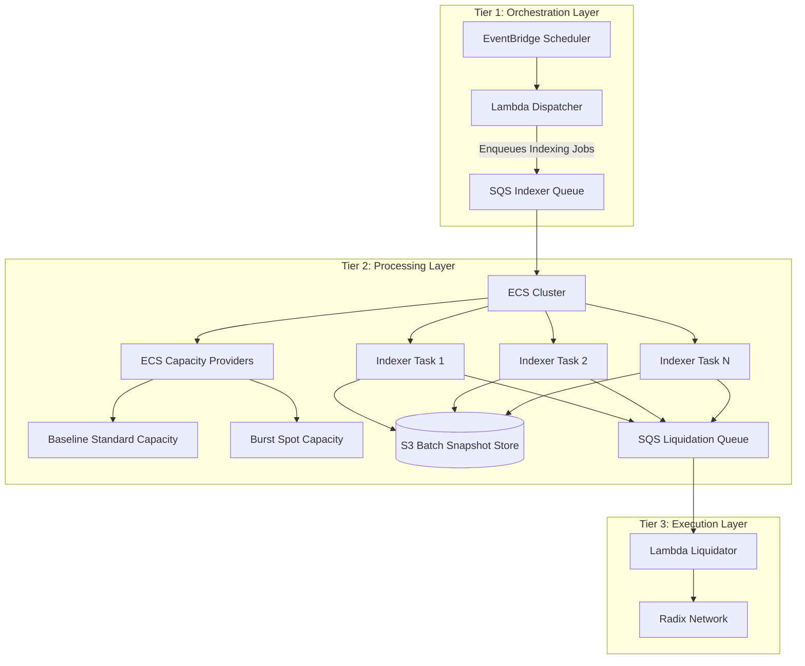

# Production-Grade Cloud Infrastructure for DeFi Liquidation Operations

This repository contains the Terraform-managed AWS infrastructure behind **Weft Finance**, a decentralized lending protocol built on **Radix DLT**.

The platform was designed for a demanding real-world backend scenario: monitor large numbers of collateralized positions, evaluate liquidation risk at scale, and execute liquidation transactions quickly during market stress, while keeping cloud costs controlled during normal conditions.

From a portfolio and engineering perspective, this project demonstrates practical experience in **cloud architecture**, **distributed backend design**, **Infrastructure as Code**, **scalable event-driven systems**, **cost-aware AWS operations**, and **production-focused observability**.

---

## What This Project Demonstrates

This project highlights hands-on capability in areas that are highly relevant to cloud, platform, DevOps, backend, and infrastructure engineering roles:

* designing a distributed AWS architecture for a time-sensitive financial workload,
* structuring Terraform into reusable modules, service blueprints, and environment-specific deployments,
* building queue-driven workflows with explicit fault isolation and back-pressure,
* balancing latency, resilience, and cost through targeted service choices,
* implementing observable infrastructure with centralized logs and metrics,
* validating operational recovery through full teardown and redeployment.

---

## Project Context

Weft Finance must continuously assess the health of a large set of **Collateralized Debt Positions (CDPs)**. When market conditions change and a position becomes unsafe, the platform must detect that condition and attempt liquidation quickly enough to protect protocol solvency.

That creates a challenging backend problem with three competing demands:

* maintain a near-current operational view of on-ledger state,
* process large volumes of positions efficiently,
* react quickly during bursts of liquidation pressure without paying for peak infrastructure all the time.

This repository implements the cloud infrastructure that supports that operating model.

---

## How This Repository Fits into the Platform

The Weft backend is intentionally split across two repositories:

- **[weft-backend-resources](https://github.com/atoumbre/weft-backend-resources)** defines the cloud platform: queues, schedulers, ECS services, Lambda triggers, storage, observability, and deployment automation.
- **[weft-backend-services](https://github.com/atoumbre/weft-backend-services)** defines the executable workloads that run on that platform.

Together, they form a single backend system.

## Architecture Overview

The system uses **scheduled polling plus asynchronous internal processing**.

Rather than relying on a continuously running streaming architecture, it follows a simpler and more cost-efficient control loop:

1. a scheduler triggers a dispatcher every 5 minutes,
2. the dispatcher partitions the workload into batches,
3. indexer workers process those batches and identify liquidation candidates,
4. liquidation jobs are queued and drained independently,
5. stale candidates are validated again before execution.

This approach was chosen deliberately. It provides a strong balance between **operational simplicity**, **resilience**, **scalability**, and **cost control**.

### Core performance targets

* **Polling cadence:** every 5 minutes
* **Liquidation queue drain target:** under 15 seconds once a liquidation job reaches the execution queue

This means the platform is designed for **near-real-time enforcement**, not ultra-low-latency streaming. That tradeoff is intentional and aligned with the protocol’s operational needs.

---

## High-Level Architecture

```mermaid
graph TD

    subgraph "Tier 1: Orchestration Layer"
        EB[EventBridge Scheduler] --> D[Lambda Dispatcher]
        D -- "Enqueues Indexing Jobs" --> Q1[SQS Indexer Queue]
    end

    subgraph "Tier 2: Processing Layer"
        Q1 --> ECS[ECS Cluster]
        ECS --> CP[ECS Capacity Providers]
        CP --> OD[Baseline Standard Capacity]
        CP --> SP[Burst Spot Capacity]
        ECS --> I1[Indexer Task 1]
        ECS --> I2[Indexer Task 2]
        ECS --> IN[Indexer Task N]
        I1 --> S3[(S3 Batch Snapshot Store)]
        I2 --> S3
        IN --> S3
        I1 --> Q2[SQS Liquidation Queue]
        I2 --> Q2
        IN --> Q2
    end

    subgraph "Tier 3: Execution Layer"
        Q2 --> L[Lambda Liquidator]
        L --> RN[Radix Network]
    end
```

---

## Tier 1: Orchestration Layer

### Dispatcher

The **Dispatcher** is an AWS Lambda function triggered by **EventBridge Scheduler** every 5 minutes.

Its responsibilities are straightforward:

* query the Radix Gateway for the current synchronization point,
* determine which positions or ranges need to be evaluated,
* partition that workload into manageable units,
* push those units into the Indexer queue.

This tier is intentionally lightweight. It does not perform heavy protocol computation; it exists to orchestrate work predictably and cheaply.

Using Lambda here keeps the orchestration layer stateless, low-cost, and simple to operate.

---

## Tier 2: Processing Layer

### Indexer

The **Indexer** is the main processing tier. It runs on **Amazon ECS** and performs the heavier evaluation work required to determine whether positions are healthy or liquidation candidates.

Each indexing task:

* reads a batch message from SQS,
* fetches the relevant CDP data from the Radix Gateway,
* computes health and eligibility metrics,
* writes a **batch snapshot** to S3,
* enqueues liquidation jobs for positions that breach protocol thresholds.

### Compute strategy

The ECS cluster uses a mixed-capacity model:

* **one standard instance** remains online as baseline capacity,
* additional capacity is added through **Spot-backed instances** when workload increases.

This creates a practical balance between availability and cost efficiency. The platform keeps a minimal always-on processing footprint, then scales more economically during bursts.

### Why ECS for the Indexer

The indexer is better suited to ECS than to short-lived Lambda execution because the workload is batch-oriented and variable in duration. It benefits from stable compute, queue-based scaling, and a capacity model that can combine predictable baseline resources with cheaper burst capacity.

### State persistence

The indexer writes **batch snapshots** to **Amazon S3**.

S3 is used here as a durable and cost-effective store for derived off-chain outputs, not as the system of record. The authoritative source of truth remains the **Radix ledger**. That distinction is important: the cloud backend materializes operational state for monitoring, analysis, and execution, but does not replace the blockchain as the core data authority.

---

## Tier 3: Execution Layer

### Liquidator

The **Liquidator** is an AWS Lambda function triggered by the **Liquidation SQS queue**.

Each invocation handles a single liquidation unit of work. This keeps the execution layer narrow, isolated, and easy to scale during bursts.

Its responsibilities include:

* loading the queued liquidation candidate,
* validating that the candidate is still actionable,
* constructing and submitting the transaction,
* recording execution outcome for monitoring and troubleshooting.

Lambda is a strong fit for this tier because liquidation work in burst, independent, and short-lived.

---

## Reliability and Message Safety

### Durable queue boundaries

The system uses **Amazon SQS** between tiers to create durable handoff boundaries. This improves resilience and fault isolation: if one service slows down or temporarily fails, work is buffered rather than lost.

### At-least-once delivery

Because the queues operate with **at-least-once delivery**, duplicate processing is a normal part of the system model. The architecture is designed with that assumption in mind.

### Stale message validation

A liquidation candidate may become outdated between detection and execution. For example, a position may already have been healed, repaid, or liquidated by the time the execution function runs.

To handle that safely, the liquidator performs **stale message validation** before attempting execution. If a queued liquidation is no longer actionable, it is treated as a safe no-op rather than a failure.

This is a key correctness mechanism in the platform. It allows the system to use asynchronous queues without turning delay into protocol risk.

### Back-pressure and controlled degradation

The design makes pressure visible instead of hiding it:

* if indexing slows, the indexer queue grows,
* if execution slows, the liquidation queue grows,
* Both remain observable through queue depth and message age.

That is a deliberate operational choice. The goal is not to pretend the system never experiences backlog; the goal is to make backlog **safe, measurable, and manageable**.

---

## Observability

The platform is built with operational visibility in mind.

Logs and metrics are pushed to **Grafana Cloud** using **Grafana Terraform templates**, which provision the required integration path under the hood. In practice, the default Grafana Cloud dashboards already cover the team’s needs well, so the setup provides strong visibility with very little customization overhead.

### What is monitored

The most meaningful operational signals in this system are:

* SQS queue depth,
* SQS oldest message age,
* indexer throughput,
* liquidation throughput,
* Lambda error and throttling metrics,
* ECS task and capacity health,
* budget and spend indicators.

For this architecture, **queue age** is especially important because it reflects real pipeline health more clearly than generic infrastructure metrics alone.

---

## Security and Governance

### Deployment security

Infrastructure is deployed through **GitHub Actions** using **AWS OIDC federation**, eliminating the need for long-lived AWS credentials in CI/CD.

### Cost governance

The platform includes budget alerting so the team can detect abnormal spend early, especially during periods of high market volatility.

### Administrative controls

Administrative artifacts are stored in secured S3 storage with infrastructure-managed access controls.

### Runtime security posture

The intended runtime baseline follows standard production practices:

* least-privilege IAM for services,
* controlled access to storage resources,
* encryption in transit and at rest where supported,
* no reliance on manually distributed static cloud credentials.

---

## Infrastructure as Code

The Terraform codebase follows a three-layer structure designed for reuse, clarity, and environment parity.

| Layer            | Path            | Purpose                                                                                                                       |
| ---------------- | --------------- | ----------------------------------------------------------------------------------------------------------------------------- |
| **Modules**      | `modules/`      | Reusable infrastructure primitives such as secure S3 buckets, ECS services, scheduled Lambda functions, and autoscaling logic |
| **Blueprints**   | `blueprints/`   | Higher-level service compositions that package modules into deployable capabilities                                           |
| **Environments** | `environments/` | Thin environment definitions such as `mainnet` and `stokenet` that parameterize shared blueprints                             |

This structure makes the architecture easier to extend and maintain. It also reduces drift between environments by keeping most infrastructure logic shared and moving environment-specific tuning into configuration.

---

## CI/CD and Change Safety

All infrastructure changes are managed through Git-based workflows and automated deployment pipelines.

### Pull request workflow

On pull requests, the pipeline runs validation and `terraform plan`, allowing infrastructure changes to be reviewed before merge.

### Deployment workflow

On merge, the pipeline runs `terraform apply` against the target environment, making version-controlled automation the default path for change.

### State protection

Terraform state locking is handled through **DynamoDB**, which prevents concurrent applies from corrupting infrastructure state.

### Local validation

Repository scripts such as `terraform-check-all.sh` provide quick feedback on syntax, formatting, and multi-environment consistency before changes reach CI.

---

## Recovery Posture

The backend is operationally favorable to recovery because it is largely infrastructure-defined and the **Radix ledger remains the source of truth**.

A **full teardown and successful redeployment** of the stack has already been tested. That is a strong practical signal that the platform can be recreated cleanly from code.

Formal cross-region failover has not yet been tested as an incident scenario. However, given the successful full redeployment test, regional recreation is expected to be straightforward and primarily a matter of changing region-specific configuration.

That recovery posture can be summarized simply:

* **tested:** full teardown and rebuild,
* **not yet formally tested:** cross-region incident failover,
* **strength:** reproducible infrastructure with minimal dependence on off-chain primary state.

---

## Why This Project Matters

This repository is more than a DeFi backend. It is a concrete example of production-oriented infrastructure engineering.

It demonstrates the ability to:

* translate a financial operations problem into a scalable cloud architecture,
* choose the right AWS services for different workload patterns,
* structure Terraform for reuse and maintainability,
* make explicit tradeoffs between cost, latency, and resilience,
* design systems that remain observable and recoverable under stress.

For recruiters and hiring managers, the key takeaway is simple: this project shows practical experience building and operating **distributed AWS infrastructure for a time-sensitive production workload**.

---

## Engineering Highlights

* **Cloud architecture:** designed a multi-tier AWS system using Lambda, ECS, SQS, S3, EventBridge, and Grafana Cloud
* **Infrastructure as Code:** organized Terraform into reusable modules, higher-level blueprints, and thin environment definitions
* **Scalability:** combined baseline compute with Spot-backed burst capacity for variable workloads
* **Reliability:** used durable queue boundaries and stale-message validation to improve operational safety
* **Observability:** implemented centralized logs and metrics with low-maintenance Grafana Cloud integration
* **Recovery:** validated full teardown and redeployment from Terraform-managed infrastructure
* **Cost awareness:** optimized for low steady-state cost while preserving responsiveness during liquidation events

---

## Future Improvements

Near-term improvements include stronger circuit-breaker behavior around upstream dependency degradation, more aggressive batching against external APIs, and richer replay or incident-analysis tooling.

Longer term, the platform also creates a path toward historical analytics through S3 snapshots, Parquet storage, AWS Glue cataloging, and Athena-based querying.
